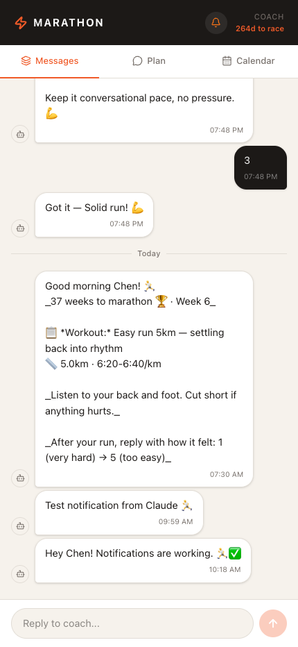
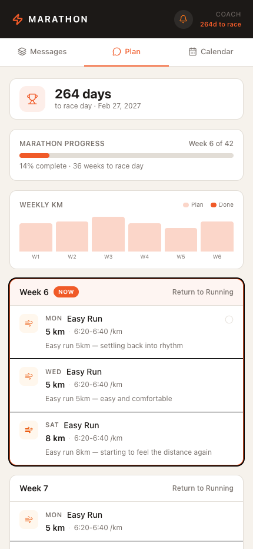
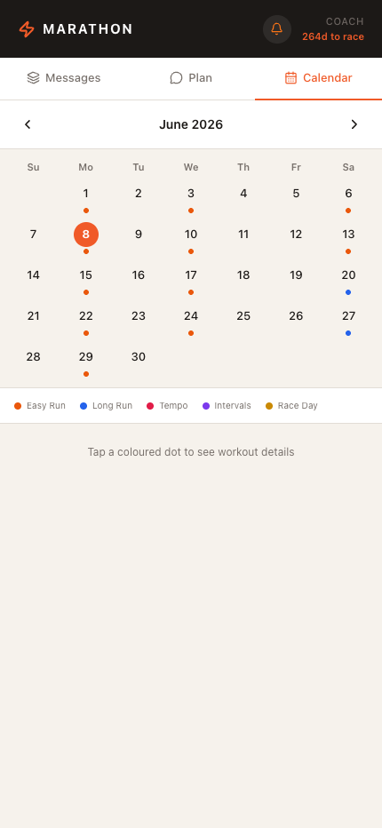

# Marathon Agent

An AI-powered personal running coach that sends daily workout instructions via push notification, adapts training based on real recovery data, and lives in a mobile-first PWA — deployed and running 24/7 in the cloud.

**Live demo:** https://marathon-coach-chen.fly.dev

<p align="center">
  
  
  
</p>

---

## What it does

Every morning at 7:30 AM the agent:

1. **Fetches recovery data** from Garmin Connect (HRV + Body Battery)
2. **Calls Claude** to decide whether to run the planned workout, modify it, or recommend rest — based on recovery + recent training load from Strava
3. **Sends a push notification** with the adapted workout to the PWA
4. **Checks Google Calendar** for upcoming academic deadlines and sends reminders

After each run, the athlete replies with a 1–5 effort rating. Every Monday the agent reviews the previous week's Strava data vs. the plan, recalibrates pace zones with Claude, and updates all future workouts automatically.

---

## Tech stack

| Layer | Tech |
|---|---|
| Backend | Python · FastAPI · APScheduler |
| AI | Claude Haiku (Anthropic) — workout adaptation + coach chat |
| Integrations | Strava Webhook API · Garmin Connect · Google Calendar API |
| Push | Web Push (VAPID) via pywebpush |
| Frontend | React · TypeScript · Vite · Tailwind · PWA |
| Database | SQLite |
| Deployment | Fly.io (Docker, persistent volume) |

---

## Features

- **Adaptive workouts** — Claude analyses HRV, body battery, and recent runs to modify or cancel workouts on the fly
- **AI coach chat** — in-app chat with a context-aware running coach that knows your plan, pace zones, and medical history
- **Training plan viewer** — scrollable week-by-week plan with phase labels and workout details
- **Calendar view** — full calendar with colour-coded workout dots and post-run feeling scores
- **Weekly mileage chart** — planned vs. actual km per week
- **Deadline reminders** — scans Google Calendar for academic submissions and sends push reminders 7 and 1 day before
- **Weekly pace recalibration** — automatically tightens or loosens pace zones based on how workouts actually felt

---

## Project structure

```
marathon-agent/
├── agent/
│   ├── main.py              # FastAPI app + API routes
│   ├── scheduler.py         # APScheduler (morning msg, deadlines, weekly review)
│   ├── adaptation.py        # Claude-powered workout adaptation engine
│   ├── chat.py              # AI coach chat (context-aware Claude calls)
│   ├── training_plan.py     # Plan DB queries + feedback
│   ├── garmin.py            # Garmin Connect HRV + Body Battery
│   ├── strava.py            # Strava OAuth + activity sync
│   ├── calendar_client.py   # Google Calendar deadline detection
│   ├── push_client.py       # Web Push (VAPID) sender
│   ├── db.py                # SQLite schema + connection
│   ├── config.py            # Config loader (config.yaml)
│   └── handlers/
│       ├── morning.py        # Daily 7:30 AM workout message
│       ├── post_run.py       # Strava webhook → post-run summary
│       ├── weekly_review.py  # Monday pace recalibration
│       └── deadline.py       # Academic deadline reminders
├── frontend/                # React/Vite PWA
│   ├── src/App.tsx          # Messages · Plan · Calendar tabs
│   └── public/sw.js         # Service worker (push notification handler)
├── scripts/
│   ├── build_training_plan.py   # Seed training plan into DB
│   ├── strava_auth.py           # OAuth flow for Strava
│   ├── garmin_auth.py           # Garmin token setup
│   ├── google_auth.py           # Google Calendar OAuth
│   └── gen_vapid.py             # Generate VAPID keys for Web Push
├── Dockerfile
├── fly.toml
└── config.yaml              # User preferences (fill this in)
```

---

## Setup

### 1. Configure

```bash
cp config.yaml.example config.yaml   # fill in your details
cp .env.example .env                  # fill in API keys
```

**config.yaml** — set your name, timezone, marathon date, run days, and pace targets.

**\.env** — add your Strava, Anthropic, and Garmin credentials.

### 2. Authenticate third-party services

```bash
source venv/bin/activate

python scripts/strava_auth.py        # opens browser OAuth → saves tokens to DB
python scripts/garmin_auth.py        # saves Garmin session tokens
python scripts/google_auth.py        # Google Calendar OAuth
python scripts/gen_vapid.py          # generates VAPID keys for push notifications
```

### 3. Build the training plan

```bash
python scripts/build_training_plan.py
```

### 4. Run locally

```bash
cd frontend && npm run build          # build the PWA
source venv/bin/activate
python agent/main.py                  # starts on http://localhost:8000
```

### 5. Deploy to Fly.io

```bash
fly launch   # first time
fly deploy   # subsequent deploys
```

Secrets go on Fly, not in the image:

```bash
fly secrets set ANTHROPIC_API_KEY=... STRAVA_CLIENT_ID=... # etc.
```

Data (DB, tokens, VAPID keys) lives on a persistent volume mounted at `/app/data`.

---

## How the adaptation engine works

Each morning, Claude receives:
- The planned workout (type, distance, pace)
- This week's full plan
- Morning HRV status and Body Battery %
- The last 14 days of Strava runs

It returns a JSON decision: `as_planned`, `modified`, or `rest`, plus an adapted distance, pace, and a one-sentence coach note. If the API call fails, the original plan is used as a fallback.

The weekly review follows the same pattern — Claude compares planned vs. actual pace across the week and outputs new pace ranges, which are written back to both `config.yaml` and all future rows in the training plan DB.
